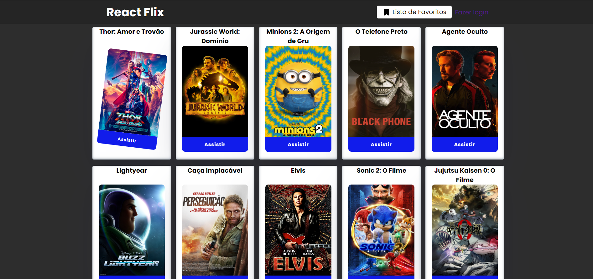
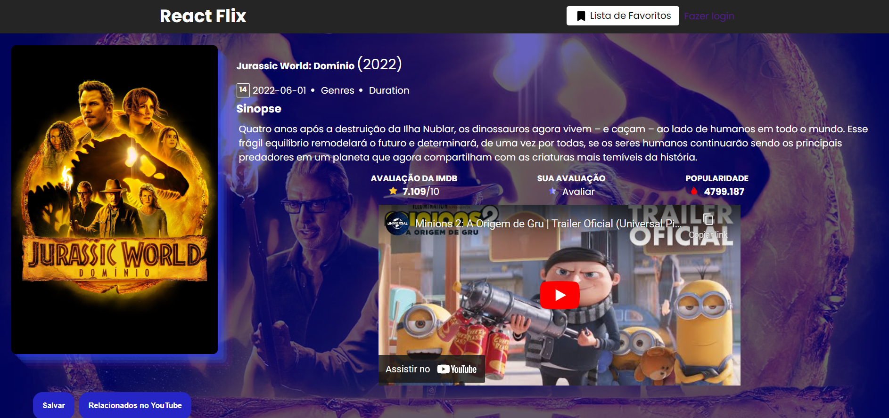
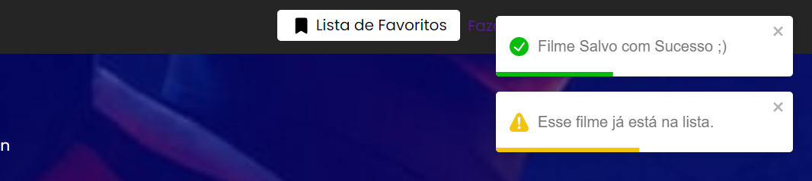
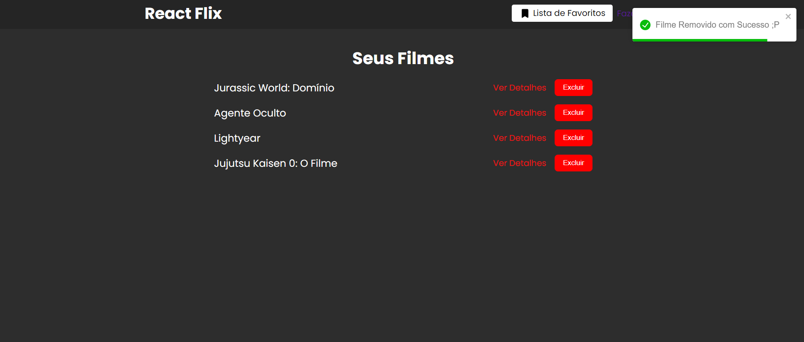

# Projeto: Plataforma de Filmes usando API da TMDB

## Ferramentas

<code></code>
<code></code>
<code></code>
<code></code>
<code></code>
<code></code>

## Packages
<code>  "dependencies": {
    "axios": "^0.27.2",
    "react": "^18.2.0",
    "react-dom": "^18.2.0",
    "react-router-dom": "^6.3.0",
    "react-scripts": "5.0.1",
    "react-toastify": "^9.0.8",
    "web-vitals": "^2.1.4"
  }
  </code>

## PrtScreens

<code></code>

<h2 align="center">Home ⬆️</h2>

<code></code>

<h2 align="center">Detalhes ⬆️</h2>

<code></code>

<h2 align="center">Alertas ⬆️</h2>

<code></code>

<h2 align="center">Lista de Favoritos ⬆️</h2>
